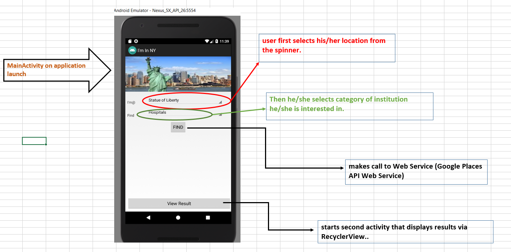
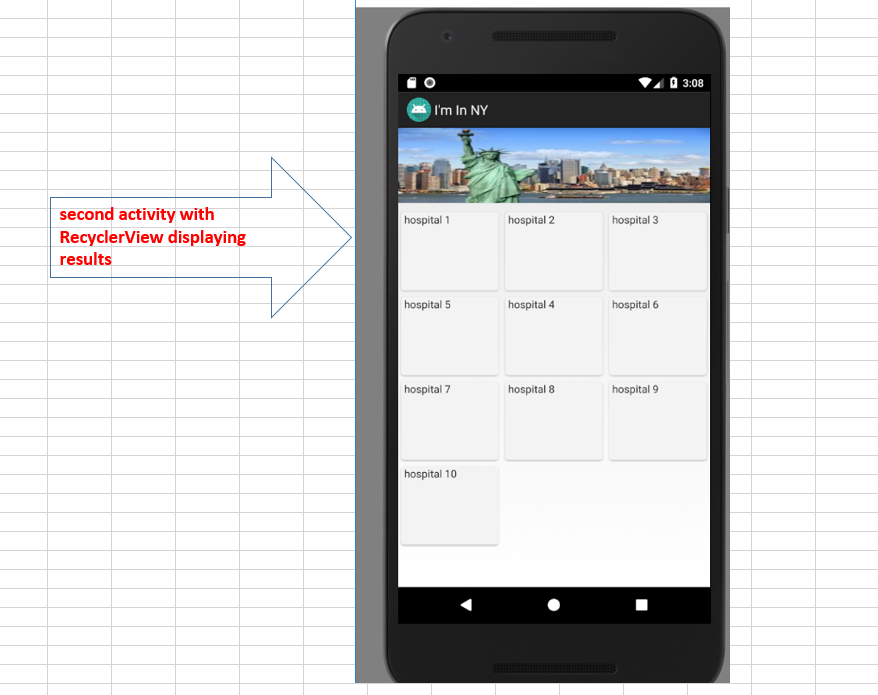

# Project Overview

Application allows user to select one specific site among 
different popular sites (like statue of liberty, empire state, manhattan, etc.
) within the state of New York and then select one point of interest
like restaurant, library, hospital etc. Application then uses Google
Places API Web Service to locate specific institutions around the site (within 1000 meters
radius).

### Wireframe

### About the Web Service

Application uses Nearby Search Requests available with [Google Places API Web
Service](https://developers.google.com/places/web-service/search).

Nearby Search Request takes the form 
**maps.googleapis.com/maps/api/place/nearbysearch/output?parameters**
where required parameters are (i) key (application key), (ii) location (latitude/
longitude around which to retrieve information), (iii) radius (the distance (in meters) 
within which to return place results.)

### Application Structure
Click on the image below to enlarge..

### Structure Details

***MainActivity.java*** is the application launcher. It provides UI to allow user
enter inputs and a button to trigger web service call. It also includes
 a broadcast receiver that is registered to receive broadcast sent by the 
 bound service. ***MyContentProvider.java***,
 ***LocationContract.java***, ***DBHelper.java*** together provide content provider
implementation. ***ResultView.java*** is the second activity that displays
RecyclerView consisting of results retrieved via web service. ***CapstoneAdapter.java***
is recyclerview specific adapter. ***WebService.java*** is a bound service that
MainActivity binds to for web service call. It uses ***ServiceHandler*** and ***Looper*** 
 to run it's logic in a separate handler thread. ***Webresponse.java*** is a POJO for
holding result data.